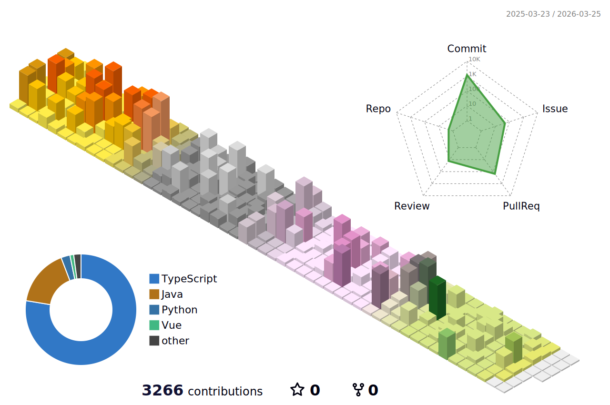

  

<!--

  
   
  
   

-->

 

<!--
## 🛠️ Tech Stack
-->

<!--
  
  
  
  
  
  
  
-->

  <!-- Frontend -->
  
  
  
  
  
  
  

  <!-- Backend -->
  
  
  
  
  
        
  
  

  <!-- Tools -->
  
  
  
  
  
  
  
  

<!--

  
  
  
  
  
  
  
  

  
  
  
  
  
  
  

 

  
  
  
  
  
  
  
  

-->

          
 
 

<!--
## 📊 GitHub Stats
-->

<!--

-->

