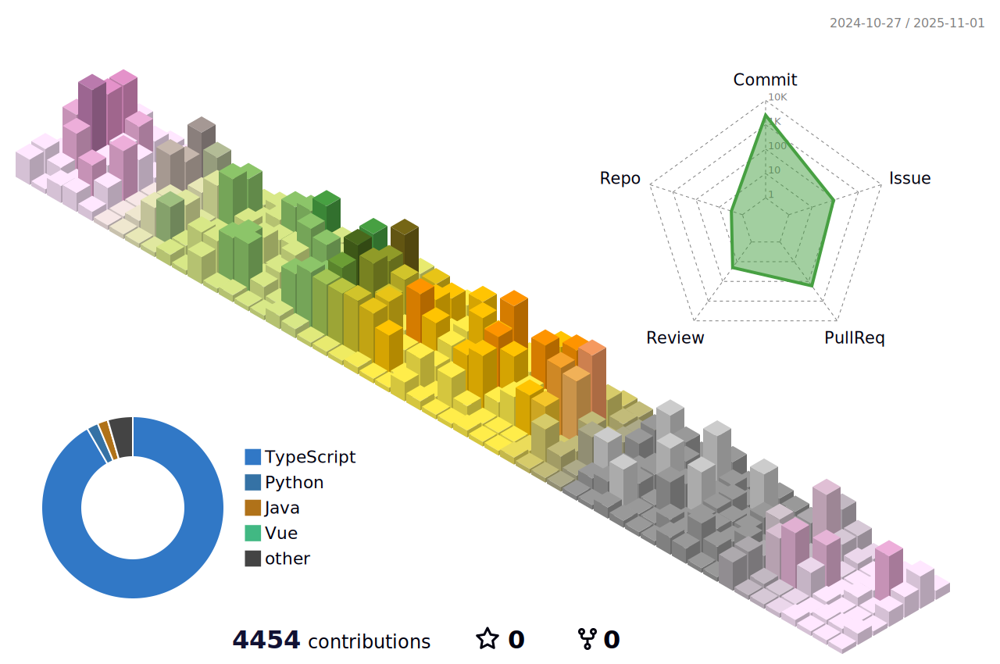
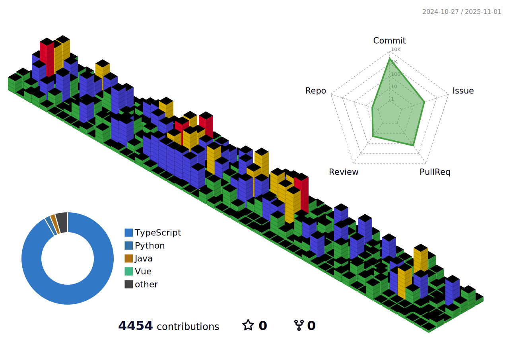

  
   
  
   

 

## 🛠️ Tech Stack

  <!-- First Row -->
  
  
  
  
  
  
  
  
  
  
  

  <!-- Second Row -->
  
  
  
  
  
  
  
  
  
  
  

  <!-- Third Row -->
  
  
  
  
  
  

          
 
 

## 📊 GitHub Stats

<!--

-->

